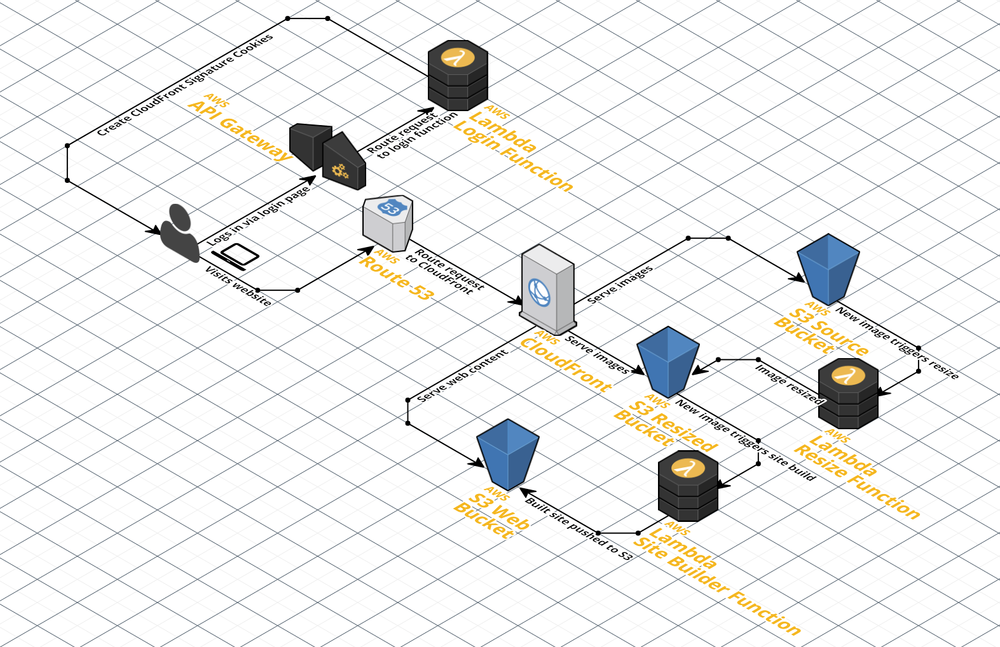

# AWSPics

> An AWS CloudFormation stack to run a serverless password-protected photo
  gallery

**Demo:** <https://awspics.net>

**Credentials:** "username" / "password"


## Goals

Host a self-contained, declarative infrastructure, password-protected,
data-driven static photo gallery to share personal pictures with friends and
family, without needing to run, maintain (or pay for) servers.

## Architecture



There are 7 main components:

1. **CloudFront with restricted bucket access** to prevent unauthenticated
   access to the site or its pictures.
2. **Login lambda function** to validate authentication and sign cookies to
   allow access to restricted buckets.
3. **Source S3 bucket** to store original pictures and metadata driving the
   site.
4. **Resized S3 bucket** to store resized versions of the original pictures.
5. **Web S3 bucket** to store the static website generated from the data in the
   source bucket.
6. **Resize lambda function** to automatically resize images added to the source
   S3 bucket and store them in the resized S3 bucket.
7. **Site builder lambda function** to automatically rebuild the static website
   when ~~changes are made to the source S3 bucket~~ a regularly scheduled event
   fires from Cloudwatch Events.

## Pre-requisites

Requires that `aws-cli`, `docker` and `htpasswd` be installed.

You'll also need a domain whose CNAME DNS value you can update.

## Instructions

A video walkthrough [is available on YouTube](https://youtu.be/010AGcY4uoE).

1. Configure `aws-cli` (recommended to use `us-east-1`, see "Miscellaneous"
   below):
   ```
   $ aws configure
   AWS Access Key ID [None]: AKIA...
   AWS Secret Access Key [None]: illx...
   Default region name [None]: us-east-1
   Default output format [None]:
   $ aws configure set preview.cloudfront true
   ```
2. Create KMS encryption key: `aws kms create-key`. Keep note of its `KeyId` in
   the response. Note that each KMS key costs $1/month.
3. Create CloudFront Key Pair, take note of the key pair ID and download the
   private key:
   <https://console.aws.amazon.com/iam/home?region=us-east-1#/security_credential>.
4. Encrypt the CloudFront private key:
   ```
   aws kms encrypt --key-id $KMS_KEY_ID --plaintext "$(cat pk-*.pem)" \
                   --query CiphertextBlob --output text
   ```
5. Create a local `htpasswd` file with your usernames and passwords.
   You can generate the hashes from the command line:
   ```
   $ htpasswd -nB username > htpasswd
   New password: **********
   Re-type new password: **********
   ```
6. Encrypt your `htpasswd` file using KMS again:
   ```
   aws kms encrypt --key-id $KMS_KEY_ID --plaintext "$(cat htpasswd)" \
                   --query CiphertextBlob --output text
   ```
7. Create CloudFront Origin Access Identity, take note of the identity in the
   response:
   ```
   aws cloudfront create-cloud-front-origin-access-identity \
                  --cloud-front-origin-access-identity-config \
                  "CallerReference=$(cat /dev/urandom | base64 | base64 | head -c 14),Comment=AWSPics OAI"
   ```

8. Create Image Magick Lambda Layer for Amazon Linux 2 AMIs.

   While logged into AWS, go to this link:
   ```
   <https://serverlessrepo.aws.amazon.com/applications/arn:aws:serverlessrepo:us-east-1:145266761615:applications~image-magick-lambda-layer>
   ```
   Click Deploy (currently the orange button on the upper left).

   Then click on your Lambda - Layers and you will see a version ARN that looks like:
   ```
   Name          Version  Version ARN
   image-magick  1        arn:aws:lambda:us-east-1:000000000000:layer:image-magick:1
   ```
   Hold on to that ARN for later.

## Deployment

Create a configuration file called `dist/config.json`, based on
[config.example.json](config.example.json). Make sure you don't commit this file
to source control (the `dist` folder is ignored).

It should contain the following info - minus the comments:

```js
[
  // -------------------
  // PLAIN TEXT SETTINGS
  // -------------------

  // website domain
  "website=website.com",
  // title for the website
  "websiteTitle=My awesome private photo gallery",
  // S3 bucket where the static website generated from the data in the
  // source bucket will be stored
  "webBucket=html-files-here",
  // S3 bucket where original pictures and metadata driving the site will be
  // stored
  "sourceBucket=original-images-here",
  // S3 bucket where resized images will be stored
  "resizedBucket=resized-images-here",
  // Origin Access Identity from step 7
  "originAccessIdentity=EJG...",
  // how long the CloudFront access is granted for, in seconds
  // note that the cookies are session cookies, and will get deleted when the
  // browser is closed anyway
  "sessionDuration=86400",
  // Optional tracking ID for Google Analytics, if specified then a GA JS
  // snippet will be outputted in the site's HTML, or leave blank for no GA
  "googleanalytics=",
  // Optionally override the path prefix for where original albums and their
  // pictures live, or leave blank to have this default to "pics/original/"
  "picsOriginalPath=",
  // Optionally sort albums by name when building the homepage (if
  // groupAlbumsIntoCollections is disabled), or when building collection pages
  // (if groupAlbumsIntoCollections is enabled), specify either "asc" or "desc",
  // or leave blank to output albums in the order that they're returned from
  // the S3 list objects call
  "albumSort=",
  // Optionally sort pictures in all albums by name when building album pages,
  // specify either "asc" or "desc", or leave blank to output pictures in the
  // reverse order that they're returned from the S3 list objects call
  "pictureSort=",
  // Optionally sort collections by name when building the homepage (if
  // groupAlbumsIntoCollections is enabled), specify either "asc" or "desc", or
  // leave blank to output collections in the order that they're returned from
  // the S3 list objects call
  "collectionSort=",
  // Optionally specify "true" to indicate that the pictures have two grouping
  // levels, collections (first-level folders in the bucket) and albums
  // (second-level folders in the bucket), or leave blank to indicate that
  // the pictures just have one grouping level, albums
  "groupAlbumsIntoCollections=",
  // Indent homepage and album HTML output with spaces, specify "true" to
  // enable, or leave blank to instead indent HTML output with tabs
  "spacesInsteadOfTabs=",
  // Optionally show the specified custom HTML instead of a design credits link
  // to HTML5 UP on the home page, recommended that this be a link in the form:
  // <a href="https://site123.com">Site 123</a>
  // Note: a design credits link to HTML5 UP will still show on album pages
  "homePageCreditsOverride=",
  // Optionally hide the design credits link to HTML5 UP on the home page,
  // specify "true" to enable, or leave blank to show the link
  // Note: a design credits link to HTML5 UP will still show on album pages
  "hideHomePageCredits=",
  // KMS key ID created in step 2
  "kmsKeyId=00000000-0000-0000-0000-000000000000",
  // CloudFront key pair ID from step 3
  // This is not sensitive, and will be one of the cookie values
  "cloudFrontKeypairId=APK...",
  // ------------------
  // Image Magick Lambda Layer ARN
  // - this is needed for ImageMagick to resize images in Node.js 10.x
  // - from step 8 above
  // - context above in README
  // ------------------
  "ImageMagickLayer=arn:aws:lambda:us-east-1:........:layer:image-magick:...",

  // ------------------
  // ENCRYPTED SETTINGS
  // ------------------

  // encrypted CloudFront private key from step 4
  "encryptedCloudFrontPrivateKey=AQICAH...",

  // encrypted contents of the <htpasswd> file from step 6
  "encryptedHtpasswd=AQICAH...",

  // ------------------
  // SSL Certificate ARN
  // - provide this if you want to use an existing ACM Certificate.
  // - see below in the README
  // ------------------
  "sslCertificateArn=arn:aws:acm:us-east-1..."

]
```

You can then deploy the full stack using:

```bash
# name of an S3 bucket for storing the Lambda code
# bucket will be created if it doesn't already exist
./deploy <unique_bucket_name_here>
```

Or optionally deploy and specify the stack name (otherwise it defaults to AWSPics):

```bash
./deploy --stack-name=<stack_name_here> <unique_bucket_name_here>
```

Any subsequent changes that you make to this code can be redeployed with the
same command. CloudFormation will create a "changeset" to only update the
modified resources.

The first deployment should take about 30 minutes since there's a lot to set up.
You'll also receive an email to approve the SSL certificate request, which you
should complete quickly, so that the rest of the deployment can proceed.

You will want to update the frequency of the Cloudwatch Events Rule from its default setting at 365 days to something more appropriate to your needs. You can adjust this pre-deployment
in the app.yml file or after the fact in the AWS Management console.

### Note on ImageMagick Layer for Lambda
When Amazon deprecated Node.js 8.10, they removed ImageMagick from the Amazon Linux 2 AMIs that are required to run Node.js 10.x. Again, ImageMagick is no longer bundled with the Node.js 10.x runtime. This fix may also help with running on Node.js 12.x in the future. This provides a Lambda Layer (essentially a library) for your Lambda function that makes the existing code work with Node.js 10.x.


##### Note on SSL Cert
AWS Certificate Manager now supports SSL cert verification via DNS validation.
It is recommended that you manually request the certificate for your hosted zone and
chose DNS validation method for much faster validation. Then use the resulting ARN
in your config. You can also leave this config key empty to create the certificate as
normal.

Once the initial deployment is done, you'll need to point your domain's DNS
settings to add a CNAME to the newly created CloudFront Distribution URL, which
you can find by visiting the CloudFront section of the AWS Console. Once the DNS
update has propagated, you'll be able to access your private photo gallery at
that domain. However, there's no content yet, so you won't see much of anything.
You can generate sample albums to see it in action.

## Generate Sample Albums

There's a script included that will pull random images from
[Unsplash](https://unsplash.com/) to populate your photo gallery with sample
content.

```bash
./generate_random_albums <number of albums>
```

### How the Authentication Works

The Lambda function responsible for logging in creates signed session cookies
when given valid credentials. CloudFront will verify that every request has
valid cookies before forwarding them.

```
Browser                   CloudFront             Lambda              S3
  |                           |                    |                 |
  | ---------- get ---------> |                    |                 |
  |                           |                    |                 |
  |                      [no cookie]               |                 |
  |                           |                    |                 |
  |                           |                    |                 |
  |                           |                    |                 |
  | <------ error page ------ |                    |                 |
  |                                                |                 |
  | -------------------- login ------------------> |                 |
  | <------------------- cookies ----------------- |                 |
  |                                                                  |
  | ---------- get ---------> |                                      |
  |                           |                                      |
  |                      [has cookie]                                |
  |                           |                                      |
  |                           | -----------------------------------> |
  |                           | <------------ html page ------------ |
  | <------ html page ------- |
```

## Miscellaneous

This project only works as-is if everything is set up in the `us-east-1` AWS
region, because CloudFormation only supports SSL certificates from that region.
It's not too difficult to adapt this to work in another region, but you can't
rely on the SSL certificate being created in CloudFormation. Create it manually
(using either the AWS Console or the CLI) and reference it in the
`WebDistribution` by its ARN explicitly rather than the `!Ref SSLCert`
reference.

GeoRestriction is commented out in the CloudFront configuration in the app.yaml. If you are sharing
with friends and family in a specific geographic area, this is a slight improvement to security and
cost reduction. The US is provided as an example, but additional countries can be added to a
(whitelist/blacklist) based on their two letter ISO 3166-1 alpha-2 country code.

S3 Server Side AES256 encryption is enabled for the source and resized photo buckets and encrypts files
using the AWS S3 Master key. Each bucket is configured to force encryption of any file it receives
(you will need to check the upload box or specify it in the CLI when uploading photo files to the buckets)
and you will get access denied messages if you don't. The Resize function re-encrypts the resized photos
with AES256 SSE before uploading them into the resized bucket. Cloudfront with an OAI is able to access
files using the S3 Master Key without any issue. One cannot at this time use a KMS key for encrypting
bucket data to be accessed via Cloudfront without more complexity.

The EventInvoke config is included for SiteBuilder to prevent it from queueing up invocations and causing
multiple cloudfront invalidations at the same time. If you need to run sitebuilder more frequently, adjust
the rate of events by editing the CloudWatch Events rule in the Management console or the app.yml file.

Also, you can reduce compute costs and lock down the application several ways: 1) by manually throttling
the Resize Function and the SiteBuilder Function in Lambda in the Management console or 2) disabling the
CloudWatch Events rule that runs SiteBuilder or 3) manually disabling the trigger for a Lambda function
in the Management console.

Default directory for photos is S3://BUCKET_NAME/pics/original/YOUR_ALBUMS_GO_HERE


## Troubleshooting

If the project deploys and the login is entered correctly, but you are receiving access
denied messages, review your DNS settings. You only need a single DNS A record
pointing to the CloudFront Alias for your domain, and time for it to propagate.

If SiteBuilder is hanging or having trouble completing, you may need to adjust the rate limiting delay block in index.js.
The current S3 rate limit is 3500 writes a second, and 5500 reads/sec. If you're writing 30 files per album,
if you have more than 116 albums, you will hit the rate limit - and SiteBuilder will just hang and you will see
the files as a partial listing in the web directory.


## Credits

This project is mostly a compilation from multiple existing projects out there.

* [Multiverse HTML template](https://html5up.net/multiverse)
* [Lens HTML template](https://html5up.net/lens)
* [Log In HTML template](https://codepen.io/boudra/pen/YXzLBN)
* [Lazy Load Javascript](https://www.appelsiini.net/projects/lazyload)
* [Lambda Cloudfront Cookies](https://github.com/thumbsup/lambda-cloudfront-cookies)
* [Lambda as a Cloudfront Origin](https://www.codeengine.com/articles/process-form-aws-api-gateway-lambda/)
* [Put S3 behind Cloudfront](https://learnetto.com/blog/tutorial-how-to-use-amazon-s3-and-cloudfront-cdn-to-serve-images-fast-and-cheap)
* [Restrict S3 to only Cloudfront](https://docs.aws.amazon.com/AmazonCloudFront/latest/DeveloperGuide/private-content-restricting-access-to-s3.html)
* [Lambda with S3 tutorial](https://docs.aws.amazon.com/lambda/latest/dg/with-s3-example.html)
* [Generating Cloudfront Key Pair](https://docs.aws.amazon.com/AmazonCloudFront/latest/DeveloperGuide/private-content-trusted-signers.html)

Credits for update to nodejs 10.x and ImageMagick Layer:
* [NPM Mime Package Update v2](https://www.npmjs.com/package/mime)
* [ImageMagick after execution environment updates on AWS Forums](https://forums.aws.amazon.com/thread.jspa?messageID=906619&tstart=0)
* [ImageMagick Lambda Layer for Amazon Linux 2 AMIs](https://serverlessrepo.aws.amazon.com/applications/arn:aws:serverlessrepo:us-east-1:145266761615:applications~image-magick-lambda-layer)
* [image-magick-lambda-layer — version 1.0.0](https://github.com/serverlesspub/imagemagick-aws-lambda-2)


## License

AWSPics is MIT licensed.
